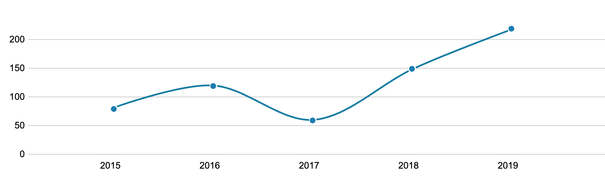

# a11y-charts

Examples of accessible D3 charts.



Built with version 5.10.0 of [D3.js](https://d3js.org/).

Tested on MacOS Catalina 10.15.3, Safari 13.0.5 using VoiceOver.

## Developing this project

```bash
git clone git@github.com:danielelder/a11y-charts.git
cd a11y-charts
```

### Build and Test

The example html can be opened directly from within the `src` folder on the file system.
